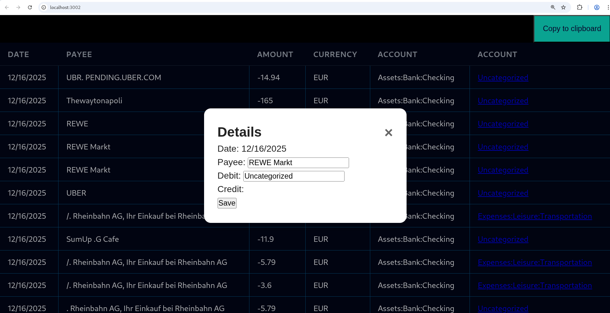

# german-bank-csv-to-ledger-cli

    Converts german bank account export .csv file into ledger-cli format by determining the recipient and deducting its respective money category from a config. The web interface can be used to find Uncategorized Accounts and populating the config with corresponding recipients. With the "copy to clipboard" function, the transactions can be exported.

## Installation with Docker

    docker build . -t germanbankconvert
    docker run -p 3002:3002 -v /home/dave/Downloads/file.csv:/data/input.csv germanbankconvert /data/input.csv

browse localhost:3002



## Manual

    git clone https://github.com/davidh38/german-bank-csv-to-ledger-cli

## Usage

    - change .conf.edn to conf.edn
      or link your existing by e.g. ln -s $HOME/Dropbox/org/conf.edn ./src/german_bank_csv_to_ledger_cli/conf.edn  
    - adapt the config to your needs
    - install leiningen
    - lein test to check, whether everything is running correctly
    - lein ueberjar

    $ java -jar german-bank-csv-to-ledger-cli-0.1.0-standalone.jar [transaction-file]
     or
    $ lein run [transaction-file]

## Examples

### ledger-cli format:
```
2021/08/13 *  DROPBOXINTE
	Expenses:Leisure:Digital:Storage  11,99 EUR
	Assets:Bank:Checking  -11,99 EUR
2021/08/12 * Expenses:Food:Supermarket
	Expenses:Food:Supermarket  1,36 EUR
	Assets:Bank:Checking  -1,36 EUR
```

## Requirements/User stories

- The german bank .csv file has to be cut first at the *booking date* line and the last line which shows the *Kontoumsaetze* has to be cut off in order to only use the transactions.
- The program distingiushes between three types of transactions:
    1. recipient is present in the **Aufftraggeber** field
    2. recipient is present in the **Betreff** and the **Aufftraggeber** is empty
    3. a Paypal transaction
- In order to determine the money category a mapping between the recipient and the money category is needed. This category has to be maintained by the user in form a conf file.
- The converted data will be printed to the command line/shell.

## Todos
- check paypal bug DONE
- delete print logs DONE
- first line in the layout should be headers DONE
- show nicer layout DONE
- improve UI -> more snappy (flex maybe) DONE
- delete the link DONE
- fix Dockerfile DONE
- create bigger popup DONE
- Popup Naming DONE
- Improve popup: longer input fields DONE
- align nice on popup DONE
- create a tag DONE
- try testing in github actions
- Check, whether the current browser suggestions are enough - yes for now DONE
- code review with a.i
- sort function or filter by uncategorized
- check brunos improvements: use destructering
- no release / package it
- get the filename of the new transactions
- suggestion: filter and search bar
- suggestion: use ornament
- suggestion: use lambda island
- suggestion: switch from javascript to clojurescript
- suggestion: switch to tailwind or ornament
- suggestion: download new transactions automatically
- suggestion: test docker usage with config file


## Summary
- [ ] CI green on main
- [ ] Version bumped
- [ ] Changelog updated
- [ ] Docs updated (if user-facing changes)
- [ ] Tag pushed
- [ ] GitHub Release created