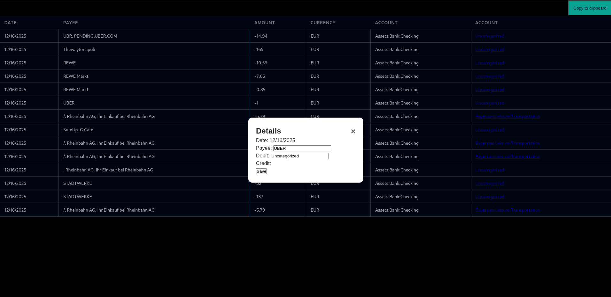

# german-bank-csv-to-ledger-cli

    Converts german bank account export .csv file into ledger-cli format by determining the recipient and deducting its respective money category from the config. 
    This only works for the .csv in the german language. If an english version is used, the program would have to be tweeked a little.



## Installation

    git clone https://github.com/davidh38/german-bank-csv-to-ledger-cli

## Usage

    - change .conf.edn to conf.edn
      or link your existing by e.g. ln -s /home/dave/Dropbox/org/conf.edn ./src/german_bank_csv_to_ledger_cli/conf.edn  
    - adapt the config to your needs
    - install leiningen
    - lein test to check, whether everything is running correctly
    - lein ueberjar

    $ java -jar german-bank-csv-to-ledger-cli-0.1.0-standalone.jar [transaction-file]
     or
    $ lein run [transaction-file]

## Examples

### ledger-cli format:
```
2021/08/13 *  DROPBOXINTE
	Expenses:Leisure:Digital:Storage  11,99 EUR
	Assets:Bank:Checking  -11,99 EUR
2021/08/12 * Expenses:Food:Supermarket
	Expenses:Food:Supermarket  1,36 EUR
	Assets:Bank:Checking  -1,36 EUR
```

## Requirements/User stories

- The german bank .csv file has to be cut first at the *Buchungstag* line and the last line which shows the *Kontoumsaetze* has to be cut off in order to only use the transactions.
- The program distingiushes between three types of transactions:
    1. recipient is present in the **Aufftraggeber** field
    2. recipient is present in the **Betreff** and the **Aufftraggeber** is empty
    3. a Paypal transaction
- In order to determine the money category a mapping between the recipient and the money category is needed. This category has to be maintained by the user in form a conf file.
- The converted data will be printed to the command line/shell.

## Todos
- check paypal bug DONE
- delete print logs DONE
- first line in the layout should be headers DONE
- improve UI -> more snappy (flex maybe)
- show nicer layout
- improve layout
- download new transactions automatically
- get the filename of the new transactions
- create bigger popup
- Improve popup: better naming and longer input fields
- Check, whether the current browser suggestions are enough
- improve layout
- update readme
- fix Dockerfile
- suggestion: switch from javascript to clojurescript
- suggestion: switch to tailwind or ornament
- code review with a.i
- suggestion: filter and search bar
- delete the link


## Summary
- [ ] CI green on main
- [ ] Version bumped
- [ ] Changelog updated
- [ ] Docs updated (if user-facing changes)
- [ ] Tag pushed
- [ ] GitHub Release created